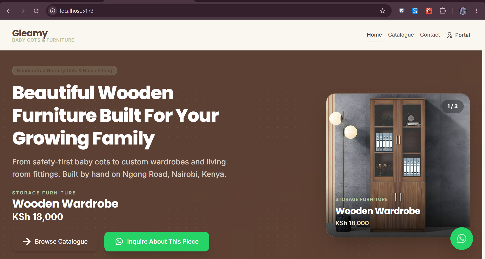
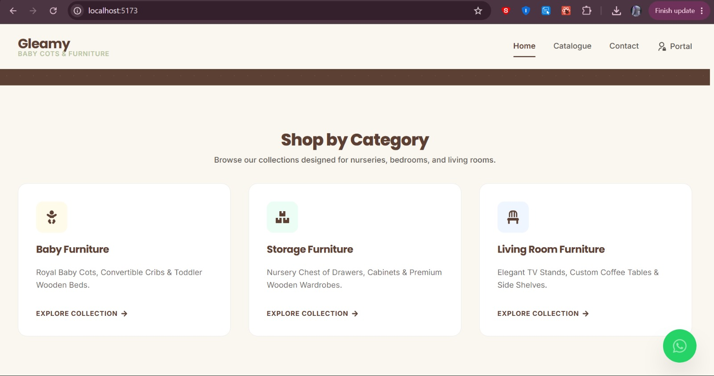
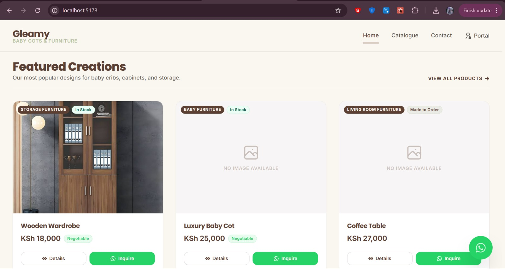
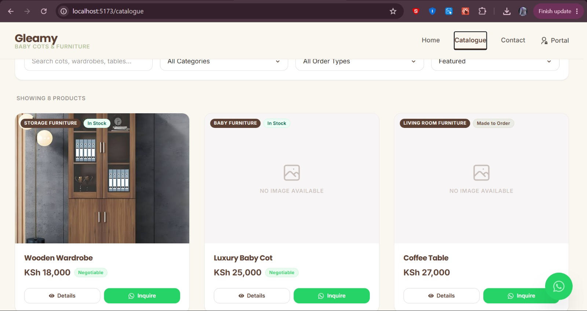
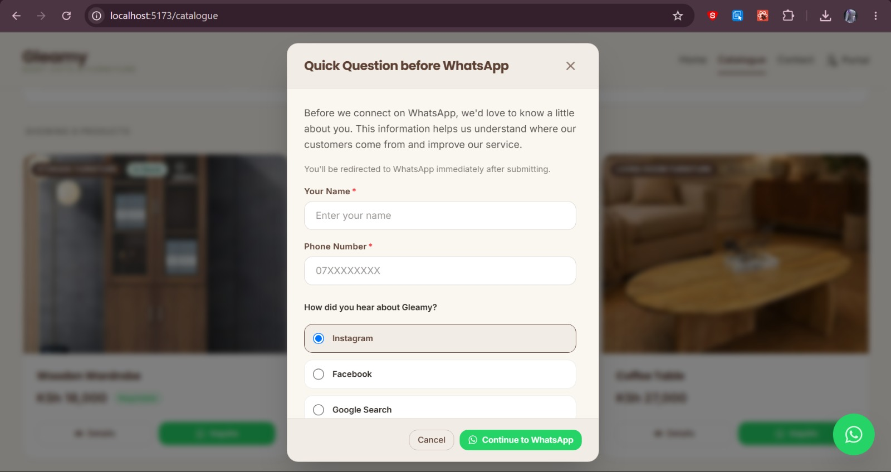
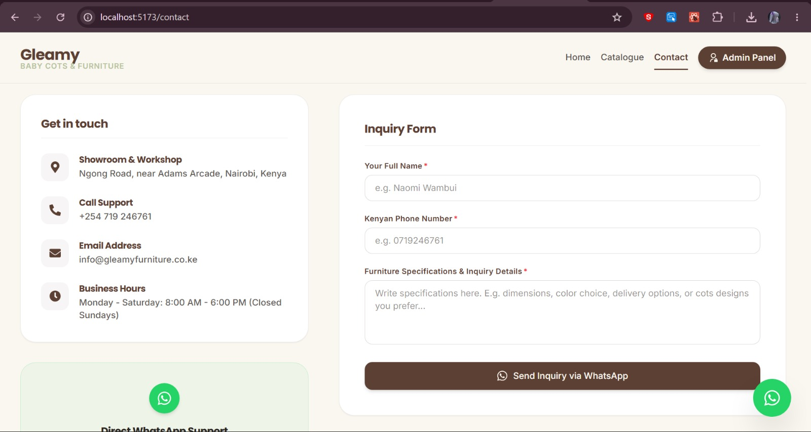
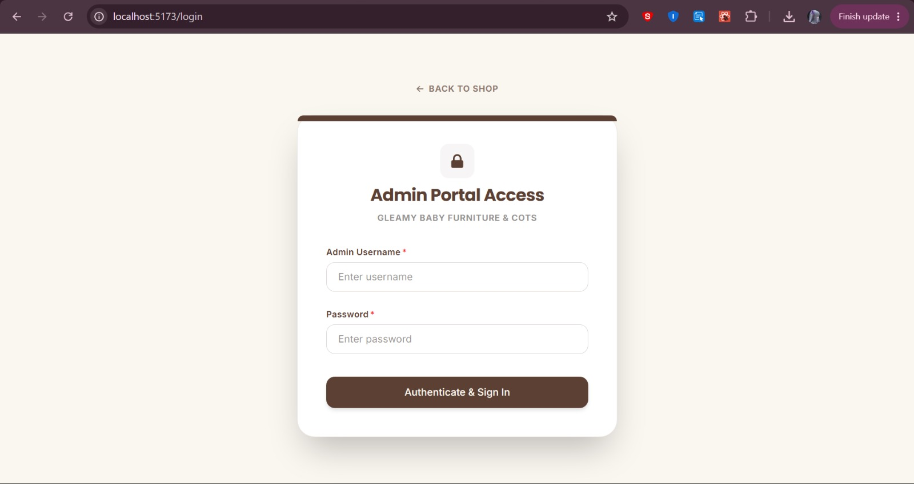
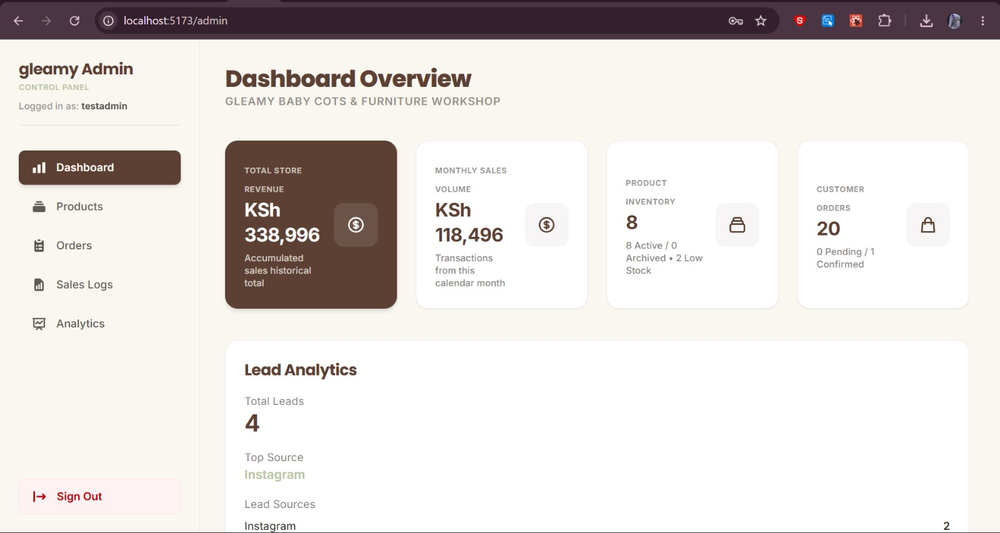
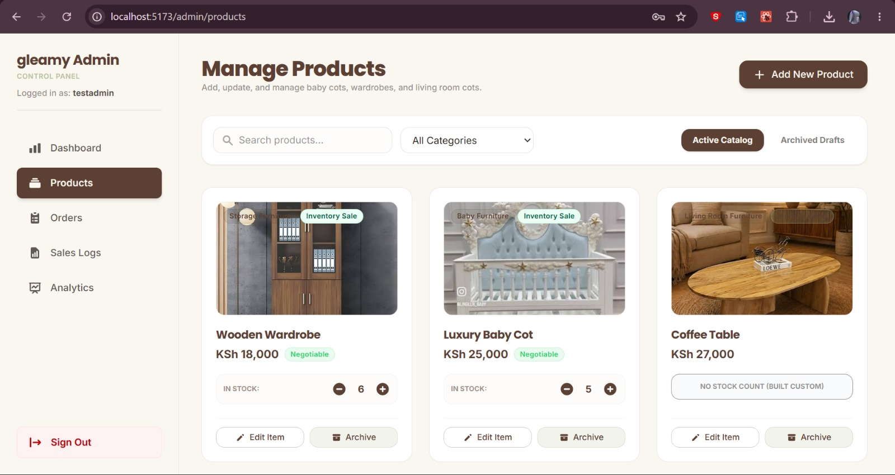
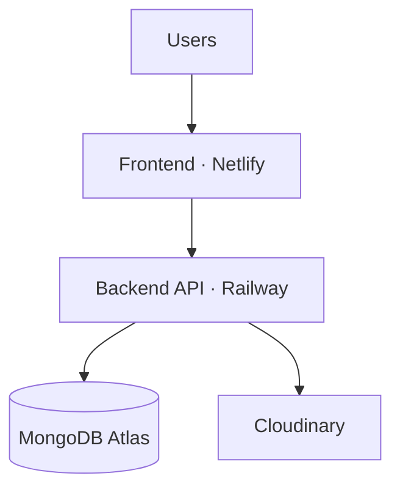

<div align="center">

# Gleamy Baby Cots & Furniture — Frontend

**Customer storefront and admin dashboard for a real furniture manufacturing business.**

Built with React, Vite, and a WhatsApp-first ordering experience for the Kenyan market.




</div>

---

## Table of Contents

- [About the Project](#about-the-project)
- [Live Preview](#live-preview)
- [Features](#features)
- [Tech Stack](#tech-stack)
- [Project Structure](#project-structure)
- [Getting Started](#getting-started)
- [Environment Variables](#environment-variables)
- [Backend Dependency](#backend-dependency)
- [Production Architecture](#production-architecture)
- [Security](#security)
- [Roadmap](#roadmap)
- [Author](#author)

---

## About the Project

Gleamy Baby Cots & Furniture is a Nairobi-based furniture manufacturer specializing in baby cots, toddler beds, storage furniture, and custom home fittings. This frontend replaces what was previously a manual, WhatsApp-only sales process with a modern digital storefront — while keeping WhatsApp as the final, familiar step customers already trust.

It ships with two experiences in one codebase:

- **A public storefront** for browsing, searching, and inquiring about products — with a lightweight lead-capture step that tells the business where its customers are coming from
- **A protected admin dashboard** for managing inventory, orders, and sales performance

---

## Live Preview

<div align="center">
<br/>
<sub><b>Rotating product hero</b> — the homepage banner auto-rotates through in-stock catalogue pieces with live images, pricing, and a direct WhatsApp inquiry CTA per product</sub>
</div>

<br/>

<table>
<tr>
<td width="50%">
<br/>
<sub><b>Category browsing</b> — designed for fast product discovery</sub>
</td>
<td width="50%">
<br/>
<sub><b>Featured products</b> — real product photography, live stock badges, one-tap WhatsApp inquiry</sub>
</td>
</tr>
<tr>
<td width="50%">
<br/>
<sub><b>Full catalogue</b> — search, category, availability, and sort filters</sub>
</td>
<td width="50%">
<br/>
<sub><b>Lead capture</b> — a quick name, phone, and referral-source step before every WhatsApp handoff</sub>
</td>
</tr>
<tr>
<td width="50%">
<br/>
<sub><b>Inquiry form</b> — routes straight into a WhatsApp conversation</sub>
</td>
<td width="50%">
<br/>
<sub><b>Admin authentication</b> — JWT-protected portal access</sub>
</td>
</tr>
</table>

<div align="center">
<br/>
<sub><b>Admin dashboard</b> — revenue, sales volume, inventory, and lead source analytics at a glance</sub>
</div>

<br/>

<div align="center">
<br/>
<sub><b>Product management</b> — live stock, pricing, and category control</sub>
</div>

---

## Features

### 🛋️ Public Website

- Dynamic, auto-rotating hero carousel showcasing live catalogue products with images, pricing, and per-product WhatsApp inquiry
- Browse and search the full product catalogue
- Filter by category and availability
- View detailed product pages with responsive image galleries
- A lightweight lead-capture step (name, phone, referral source) before every WhatsApp handoff
- Contact the business directly via WhatsApp deep links
- Explore featured and in-stock products on the homepage

### 🎠 Homepage Hero Carousel

- Pulls directly from the live product catalogue — no manually maintained banner content
- Auto-rotates every few seconds through in-stock, photographed products; pauses on hover
- Clickable dot navigation and a spotlight card linking straight to the product detail page
- Falls back gracefully to a static hero if no products currently have images

### 📦 Product Catalogue

- Dynamic, real-time product listing sourced from the backend API
- Real product photography with graceful fallbacks when an image is missing
- Category filtering and keyword search

### 📥 Lead Capture

- Short, frictionless form shown before a customer is routed to WhatsApp
- Captures how each customer found the business (Instagram, Facebook, Google Search, etc.)
- Feeds directly into the admin dashboard's Lead Analytics widget

### 🔐 Authentication

- User registration and secure login
- JWT-based authentication with persistent sessions
- Protected routes and role-based access control

### 📊 Admin Dashboard

- Business metrics: revenue, sales volume, and inventory at a glance
- Lead analytics — total leads and top referral sources
- Full product management — create, edit, archive, and restore
- Inventory monitoring with live stock adjustments
- Sales analytics with top-selling product rankings
- Cloudinary-backed product image uploads

### 📱 Responsive Design

Fully responsive across mobile, tablet, laptop, and desktop, built with CSS3 Flexbox and Grid.

---

## Tech Stack

| Layer       | Technology               |
| ----------- | ------------------------ |
| UI Library  | React                    |
| Build Tool  | Vite                     |
| Routing     | React Router             |
| HTTP Client | Axios                    |
| Styling     | CSS3, Flexbox, CSS Grid  |
| Auth        | JWT, Protected Routes    |
| Media       | Cloudinary-hosted images |
| Tooling     | Git, GitHub, VS Code     |

---

## Project Structure

```text
src/
│
├── api/          # Axios instances & API request modules
├── assets/       # Static assets
├── components/   # Reusable UI components
├── context/      # React context providers (auth, etc.)
├── features/     # Feature-scoped modules
├── hooks/        # Custom React hooks
├── layouts/      # Page layout wrappers
├── pages/        # Route-level page components
├── routes/       # Route definitions & protected route logic
├── utils/        # Helper utilities
│
├── App.jsx
└── main.jsx
```

---

## Getting Started

Clone the repository:

```bash
git clone https://github.com/Churchillcodes/gleamy-frontend.git
cd gleamy-frontend
```

Install dependencies:

```bash
npm install
```

Run in development mode:

```bash
npm run dev
```

Build for production:

```bash
npm run build
```

Preview the production build:

```bash
npm run preview
```

---

## Environment Variables

Create a `.env` file in the project root:

```env
VITE_API_BASE_URL=http://localhost:3500
```

---

## Backend Dependency

This application requires the **Gleamy Backend API** to be running.

➡️ **Backend repository:** [github.com/Churchillcodes/gleamy-backend](https://github.com/Churchillcodes/gleamy-backend)

---

## Production Architecture



---

## Security

- Protected routes on both public and admin sides
- JWT authentication with persistent, secure sessions
- Role-based access control for admin-only features
- Secure API communication with the backend

---

## Roadmap

- [ ] Shopping cart
- [ ] Online checkout
- [ ] M-Pesa integration
- [ ] Customer accounts
- [ ] Product reviews
- [ ] Wishlist functionality
- [ ] Advanced search
- [ ] Product recommendations

---

## Author

**Churchill**
Full-Stack Developer

[](https://github.com/Churchillcodes)

---

<sub>This project is proprietary software developed for Gleamy Baby Cots & Furniture.</sub>
